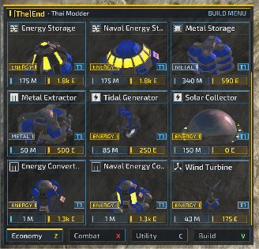

# Custom Build Menu (Glassmorphic Build Menu & 3D Model Previews)

Replaces the stock build menu with a sleek translucent cyber-glass interface organized into four hotkey-accessible categories: **Economy (Z)**, **Combat (X)**, **Utility (C)**, and **Build (V)**.

### Features
- **Real-time 3D Previews**: Rotating 3D unit models directly inside each unit card.
- **Translucent Glassmorphism**: High-contrast, sleek modern HUD styling that stays out of the way.
- **Detailed Unit Info**: Translated unit names, tech tiers, metal and energy build costs, resource production/consumption rates, and factory production queue counts.
- **Smart Auto-Visibility**: Automatically opens when selecting constructors, commanders, or factories, and remains neatly hidden when idle.

### Installation
Place the `gui_custom_build_menu` folder into your Beyond All Reason user directory under:
`Beyond-All-Reason/data/LuaUI/Widgets/gui_custom_build_menu/`

